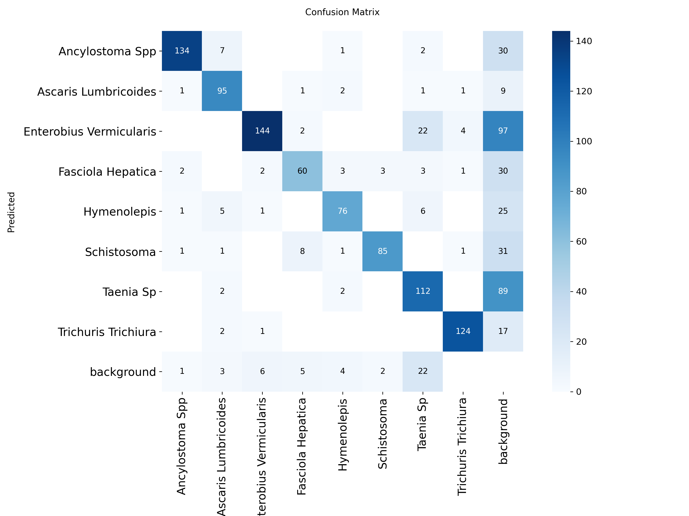
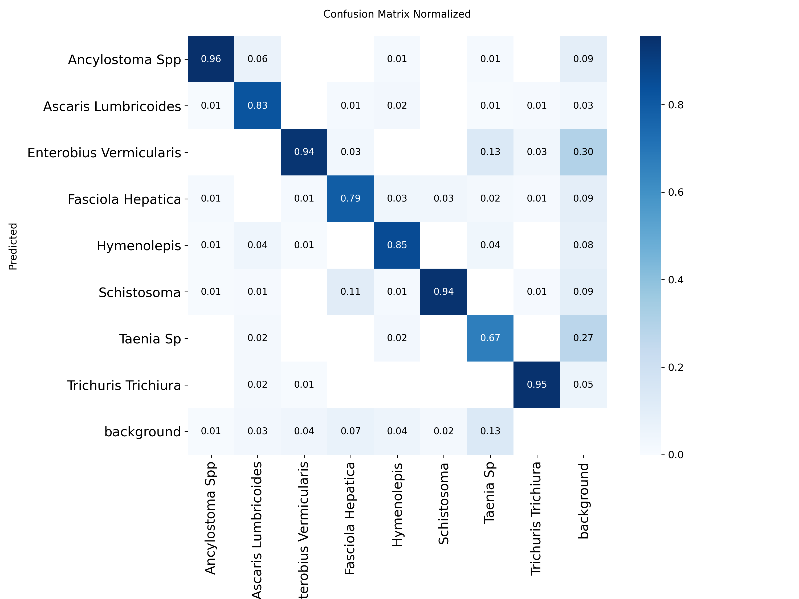
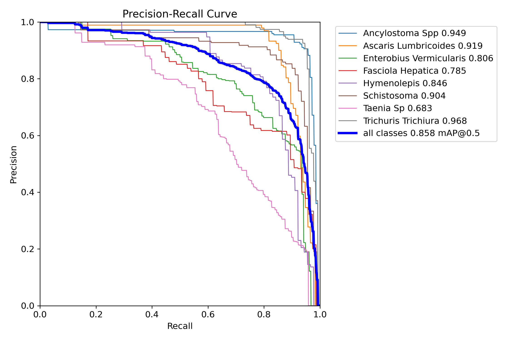
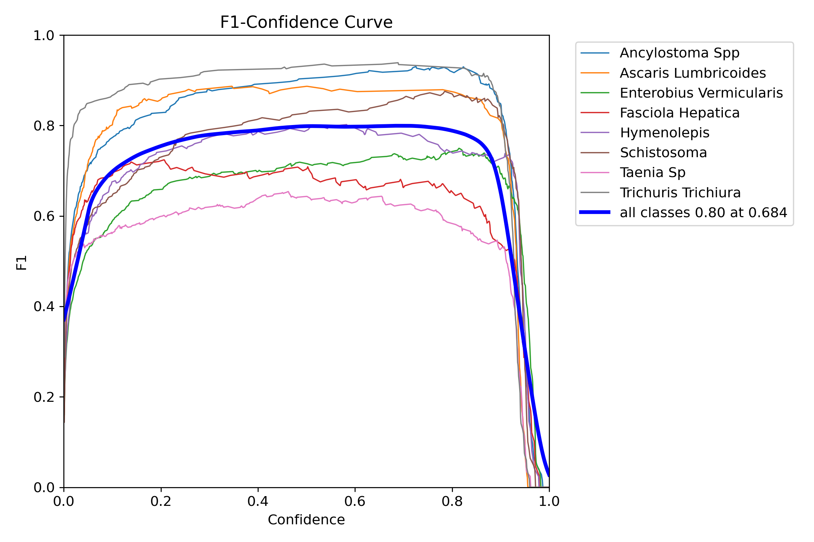
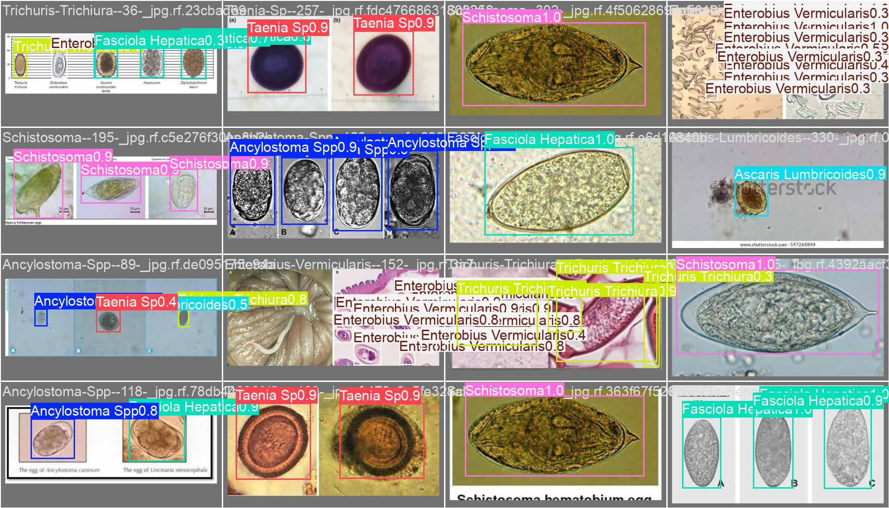

# Parasite Detection with YOLO11

This project fine-tunes YOLO11 for parasite object detection using a custom 8-class dataset. The workflow focuses on dataset quality, reproducible baseline training, validation, and controlled model improvement.

## Project Goals

* Audit the dataset before training
* Fine-tune a YOLO11 baseline model
* Evaluate precision, recall, mAP50, and mAP50-95
* Inspect confusion matrices and prediction samples
* Compare later experiments against a clear baseline

## Dataset

The dataset contains train, validation, and test splits in YOLO format.

A dataset audit was completed before training. The audit included:

* image and label count checks
* class distribution analysis
* annotation format validation
* bounding box validation
* empty label checks
* duplicate filename checks
* visual inspection of annotated samples

One invalid annotation with zero width and zero height was removed.

## Baseline Model

The baseline uses:

```text
Model: YOLO11n
Image size: 640
Epochs: 50
Batch size: 16
Device: Tesla T4
Seed: 42
```

## Baseline Results

| Model   | Image Size | Precision | Recall | mAP50 | mAP50-95 |
| ------- | ---------: | --------: | -----: | ----: | -------: |
| YOLO11n |        640 |     0.827 |  0.789 | 0.858 |    0.694 |

The baseline produced strong first-run results and visually reasonable predictions.

## Validation Artifacts

### Confusion Matrix



### Normalized Confusion Matrix



### Precision-Recall Curve



### F1 Curve



### Prediction Samples



## Next Steps

* compare YOLO11n with YOLO11s
* test higher input resolution
* inspect class-level weaknesses
* perform error analysis
* evaluate confidence thresholds
* package inference into a reusable demo

## Project Structure

```text
parasite-yolo11-detection/
├── data/
├── notebooks/
│   ├── 01_dataset_audit.ipynb
│   └── 02_baseline_training.ipynb
├── assets/
├── reports/
├── README.md
└── .gitignore
```

## Disclaimer

This project is an engineering study of object detection fine-tuning. It is not intended for clinical diagnosis.
